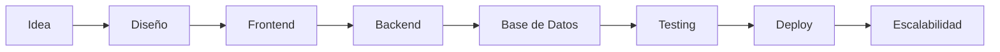

<div align="center">


</div>

<br>

<div align="center">


</div>

---

<div align="center">


</div>

#  Sobre mí


Soy **Desarrolladora Full Stack** enfocada en crear **soluciones digitales completas**, combinando diseño, lógica, arquitectura y experiencia de usuario.

Me especializo en desarrollar plataformas web y sistemas inteligentes que **refuerzan la imagen digital**, optimizan procesos y ayudan a marcas personales y negocios a posicionarse con confianza.

Siempre busco que cada proyecto sea funcional, escalable y bien pensado, más allá de lo visual.

<br><br><br><br><br><br>

---

#  Lo que hago

<div align="center">

<table>
<tr>
<td align="center" width="33%">


### Desarrollo Full Stack

Aplicaciones completas de principio a fin.

</td>

<td align="center" width="33%">


### Arquitectura Escalable

Sistemas preparados para crecer.

</td>

<td align="center" width="33%">


### Automatización

Procesos inteligentes y eficientes.

</td>

</tr>
</table>

</div>

---

#  Dashboard Tecnológico

<div align="center">


</div>

<br>

<div align="center">


</div>

---

#  Stack & Tecnologías

### Frontend

<div align="center">


</div>

<br>

### Backend & Bases de Datos

<div align="center">


</div>

<br>

### Flujo de trabajo

<div align="center">


</div>

---

#  Ecosistema de Desarrollo

<div align="center">


</div>

<br>

<div align="center">

```text
Frontend        ████████████████████ 95%
Backend         ██████████████████░░ 90%
Bases de Datos  █████████████████░░░ 88%
UI/UX           █████████████████░░░ 85%
Automatización  ██████████████████░░ 90%
Arquitectura    █████████████████░░░ 87%
```

</div>

---

#  Proyectos Destacados

<div align="center">


</div>

### Portafolio Personal

🌐 https://tracyportafolioweb.vercel.app/

En cada proyecto priorizo **claridad, rendimiento y una base técnica sólida.**

---

#  Arquitectura de Trabajo

<div align="center">



</div>

---

#  Actividad Tecnológica

<div align="center">


</div>

---

#  Conectemos

<div align="center">

<a href="https://wa.me/51906936891">

</a>

<a href="https://www.instagram.com/_sooymor/">

</a>

<a href="https://www.facebook.com/hanna.mt.1238">

</a>

<a href="https://www.linkedin.com/in/tracymooor/">

</a>

</div>

<br>

<div align="center">


</div>
