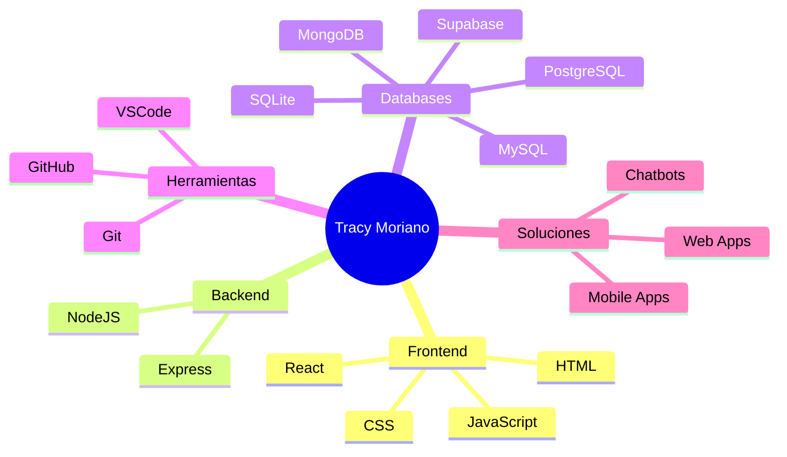
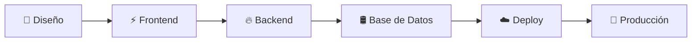

 

---

# ⚡ DASHBOARD

<table>
<tr>

<td width="33%" align="center">

### Desarrollo Full Stack

Aplicaciones completas de principio a fin.

</td>

<td width="33%" align="center">

### Arquitectura Escalable

Sistemas preparados para crecer.

</td>

<td width="33%" align="center">

### Automatización

Procesos inteligentes y eficientes.

</td>

</tr>
</table>

---

# 🌐 ECOSISTEMA TECNOLÓGICO

---

# 🚀 STACK PRINCIPAL

---

# ⚙️ FLUJO DE DESARROLLO

---

# 🖥️ ARQUITECTURA

---

# 📊 TECNOLOGÍAS

<table>
<tr>

<td align="center">

### React

</td>

<td align="center">

### NodeJS

</td>

<td align="center">

### PostgreSQL

</td>

<td align="center">

### MongoDB

</td>

</tr>
</table>

---

# 🌟 EXPERIENCIA DIGITAL

---

# 🌐 PROYECTO DESTACADO

 

### 🔹 Portafolio Personal

👉 https://tracyportafolioweb.vercel.app/

En cada proyecto priorizo **claridad, rendimiento y una base técnica sólida**.

---

# 🤝 CONECTEMOS

---

