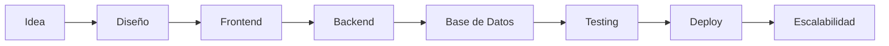

<div align="center">


</div>

<div align="center">


</div>

<br>

<div align="center">


</div>

---

# ✦ SOBRE MÍ

<table>
<tr>

<td width="65%">

Soy **Desarrolladora Full Stack** enfocada en crear **soluciones digitales completas**, combinando diseño, lógica, arquitectura y experiencia de usuario.

Me especializo en desarrollar plataformas web y sistemas inteligentes que **refuerzan la imagen digital**, optimizan procesos y ayudan a marcas personales y negocios a posicionarse con confianza.

Siempre busco que cada proyecto sea funcional, escalable y bien pensado, más allá de lo visual.

</td>

<td width="35%" align="center">


</td>

</tr>
</table>

---

# ✦ ESPECIALIDADES

<div align="center">

<table>

<tr>

<td width="33%" align="center">


### Desarrollo Full Stack

Aplicaciones completas de principio a fin.

</td>

<td width="33%" align="center">


### Arquitectura Escalable

Sistemas preparados para crecer.

</td>

<td width="33%" align="center">


### Automatización

Procesos inteligentes y eficientes.

</td>

</tr>

</table>

</div>

---

# ✦ DASHBOARD TECNOLÓGICO

<div align="center">


</div>

<br>

<div align="center">


</div>

---

# ✦ STACK TECNOLÓGICO

<div align="center">

### Frontend


<br><br>

### Backend


<br><br>

### Herramientas


</div>

---

# ✦ VISIÓN DE DESARROLLO

<div align="center">

```text
Frontend        ████████████████████ 95%
Backend         ██████████████████░░ 90%
Bases de Datos  █████████████████░░░ 88%
UI / UX         █████████████████░░░ 85%
Automatización  ██████████████████░░ 90%
Arquitectura    █████████████████░░░ 87%
```

</div>

---

# ✦ FLUJO DE CONSTRUCCIÓN



---

# ✦ PROYECTO DESTACADO

<div align="center">


</div>

### Portafolio Personal

🌐 https://tracyportafolioweb.vercel.app/

En cada proyecto priorizo claridad, rendimiento y una base técnica sólida.

---

# ✦ FILOSOFÍA

```txt
Diseñar con propósito.
Desarrollar con calidad.
Automatizar con inteligencia.
Escalar con visión.
```

---

# ✦ CONECTEMOS

<div align="center">

<a href="https://wa.me/51906936891">

</a>

<a href="https://www.instagram.com/_sooymor/">

</a>

<a href="https://www.facebook.com/hanna.mt.1238">

</a>

<a href="https://www.linkedin.com/in/tracymooor/">

</a>

</div>

<br>

<div align="center">


</div>
